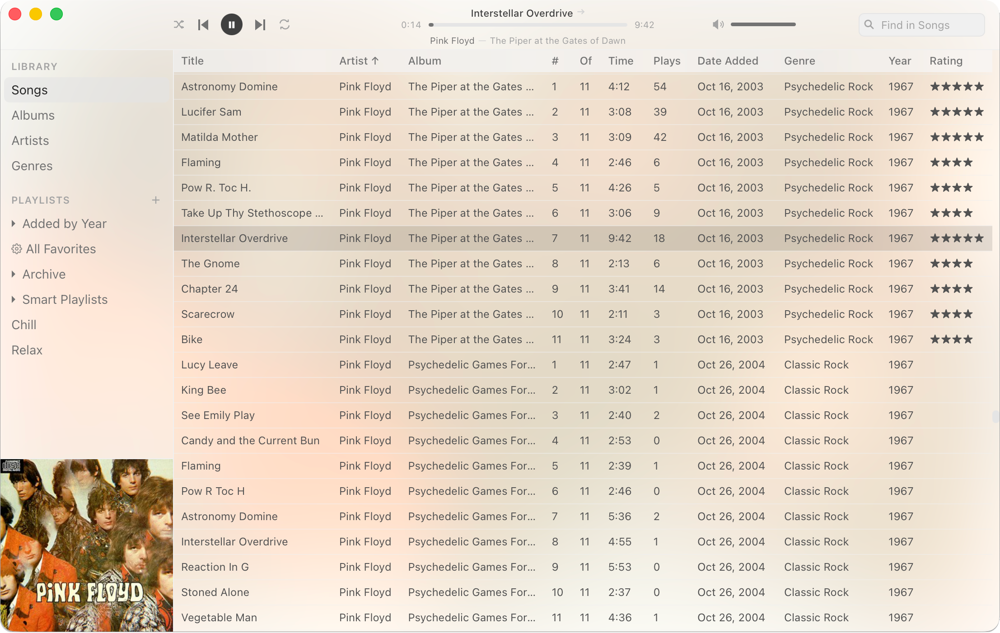

<p align="center">
  
</p>

<h1 align="center">Untune</h1>

<p align="center">
  A native macOS desktop music player built with Tauri, React, and Rust.<br>
  Imports your full Apple Music library into a fast local SQLite database.
</p>

<p align="center">
  <picture>
    <source media="(prefers-color-scheme: dark)" srcset="assets/screenshot_dark.png">
    <source media="(prefers-color-scheme: light)" srcset="assets/screenshot_light.png">
    
  </picture>
</p>

## Tech Stack

- **Tauri v2** + **Rust** backend (rodio, rusqlite, lofty, walkdir, rayon)
- **React 19** + **TypeScript** + **Vite 6** frontend
- **TanStack Table + Virtual** for 62k-row virtualized rendering
- **Tailwind CSS v4**, **Zustand** state management
- **SQLite** with WAL mode, FTS5 full-text search

## Features

- Full Apple Music library import via JXA scripts (62k+ tracks, 32 metadata fields)
- Filesystem scanning with parallel audio file parsing
- Audio playback with queue, shuffle (with back-navigation history), and repeat modes
- Browse views: Albums (virtualized grid), Artists, Genres with detail pages
- Playlist folder hierarchy (iTunes-style collapsible tree)
- Artwork pipeline: embedded metadata, Apple Music cache, folder artwork
- macOS integration: Now Playing widget with artwork, dock menu, media keys
- Keyboard shortcuts for playback, volume, navigation
- Debounced search with FTS5, type-ahead scroll
- Per-view shuffle/repeat persistence across restarts

## Prerequisites

- [Node.js](https://nodejs.org/) 20+
- [pnpm](https://pnpm.io/) 10+
- [Rust](https://rustup.rs/) 1.77+
- macOS (required for Apple Music integration and Tauri native features)

## Development

```bash
make install   # Install frontend dependencies
make dev       # Run app in development (Tauri + Vite HMR)
make build     # Build production app bundle
make check     # Type-check frontend (tsc) and backend (cargo check)
make clean     # Remove build artifacts
```

Or without Make:

```bash
pnpm install
pnpm tauri dev
```

## License

MIT
